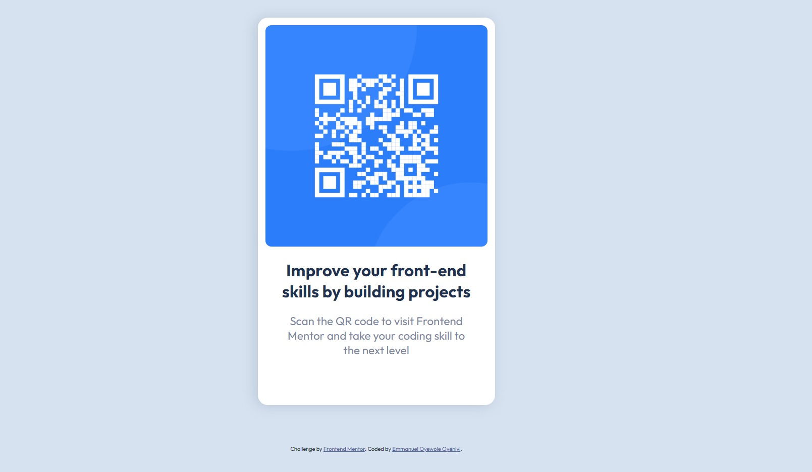

# Frontend Mentor - QR code component solution

This is a solution to the [QR code component challenge on Frontend Mentor](https://www.frontendmentor.io/challenges/qr-code-component-iux_sIO_H). Frontend Mentor challenges help you improve your coding skills by building realistic projects. 

## Table of contents

- [Frontend Mentor - QR code component solution](#frontend-mentor---qr-code-component-solution)
  - [Table of contents](#table-of-contents)
  - [Overview](#overview)
    - [Screenshot - Desktop view](#screenshot---desktop-view)
    - [Screenshot - Mobile view](#screenshot---mobile-view)
    - [Links](#links)
  - [My process](#my-process)
    - [Built with](#built-with)
    - [What I learned](#what-i-learned)
    - [Continued development](#continued-development)
  - [Author](#author)

## Overview

### Screenshot - Desktop view

### Screenshot - Mobile view

### Links

- Solution URL:(https://github.com/emmycool435/QR-CODE-COMPONENT/tree/main)
- Live Site URL:(https://emmycool435.github.io/emmycool435.github.io./)

## My process

### Built with

- Semantic HTML5 markup
- CSS custom properties
- Flexbox
- Mobile-first workflow
- [Sass](https://sass-lang.com/) - For styles

### What I learned

I've developed proficiency in essential HTML tags, CSS properties, and the utilization of Sass to elevate my projects. Moreover, I've gained expertise in structuring files in a nested format for better organization. Additionally, I've mastered Markdown for effectively documenting my projects on Frontend Mentor. Furthermore, I've acquired the skill of presenting my projects live on GitHub, showcasing them to a wider audience.

### Continued development

Given that my proficiency in React.js, JavaScript, and Tailwind CSS is not yet solidified, I aim to utilize these technologies for future projects.

## Author

- Frontend Mentor - [@emmycool435](https://www.frontendmentor.io/profile/emmycool435)
